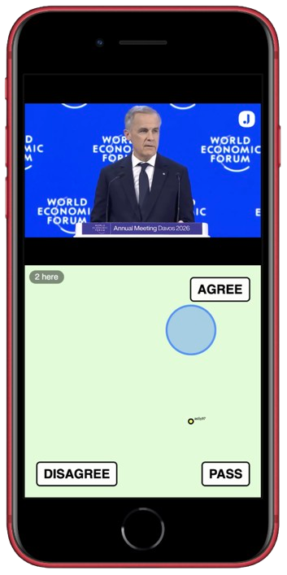
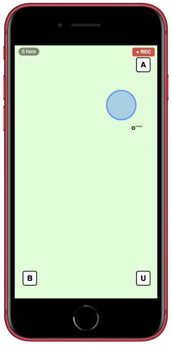
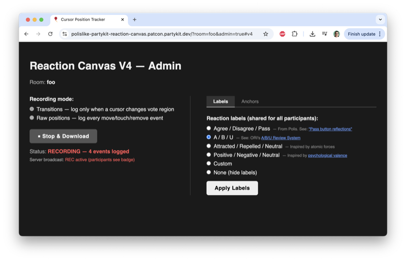

# Polislike Reaction Canvas

[](https://github.com/patcon/polislike-partykit-reaction-canvas/actions/workflows/perf-test.yml)
[](https://main--6a22541e42df9b5a4da5e047.chromatic.com)

A real-time collaborative voting canvas built on [PartyKit](https://partykit.io) (WebSockets) and React. Participants drag or touch their cursor into **Agree / Disagree / Pass** regions of a shared canvas; positions are broadcast live so everyone can see collective reactions in real time.

## Goals

- Prototype an interface for collecting vote data at synchronous events
- Enable participation without looking at your phone
- Use presence to make data collection feel collective
- Provide an admin interface for selecting statements and reviewing reactions

## Non-Goals

- No security or authentication of vote data
- No dimensional reduction on vote data
- No scalable production database

---

## Modes

### V2 — YouTube Multiplayer (Sync)

A YouTube video plays in the top half of the screen; the reaction canvas sits below. Playback is gated — the video only plays when all present participants are actively touching the canvas, creating a synchronised group-watch experience.

| Participation |
|:---:|
|  |

**URL:** `/?room=<youtube-id>#v2`

---

### V4 — Live Event

A standalone reaction canvas designed for live events. Labels and anchor positions are configurable in real time from the admin panel and broadcast to all participants instantly. Admin panel also controls recording of cursor data.

| Participation | Recording Admin |
|:---:|:---:|
|  |  |

**URL:** `/#v4` · `/?admin=true#v4` for admin

---

### Future — YouTube Multiplayer (Async)

_Coming soon._ Each participant watches and reacts independently; reactions are timestamped against the video so responses can be replayed and compared across viewers.

| Participation |
|:---:|
| _Coming soon_ |

---

## How to Contribute

- **Join the community**: [Polislike+ User Group Discord](https://polislike.short.gy/discord)
- **Attend a session**: [Weekly Polislike+ open call](https://polislike.short.gy/notes)
- **Run an event**: Try the tool at your own event — see the [event runsheet](https://docs.google.com/document/d/1cGane1pzxbFAYxEUhoL3gL0Tsiw-FvQPXhkp_d_pspg/edit) to get started
- **Improve the runsheet**: Contribute edits directly to the event runsheet
- **Share interface ideas**: Open an issue with your ideas for new interaction modes
- **Watch for activity**: Join the [Brigade Bat-Signal](#brigade-bat-signal) Telegram group to get notified when your trolling skills are needed to create swarm energy as people trial the tool

---

## Brigade Bat-Signal

When 3+ unique devices join a room, a message fires automatically to a public Telegram group. The idea: anyone watching can swoop in, join the session, and add swarm energy as people trial the tool. Trolls welcome — if they can disrupt the experience, that's useful signal about what needs hardening. It's intentionally noisy and public, keeping the tool from being mistaken for anything private or production-ready.

👉 [Join the Bat-Signal Telegram group](https://t.me/+5eIfDC36ICVmYjVh)

---

## Dev

```bash
npm run dev        # PartyKit dev server on localhost:1999
npm run storybook  # Storybook on localhost:6006
npm run deploy     # Deploy to PartyKit (commits required first)
```

See [`CLAUDE.md`](./CLAUDE.md) for full architecture notes and deploy rules.

## Stack

- [React](https://react.dev)
- [PartyKit](https://partykit.io) — WebSockets / serverless edge
- [D3](https://d3js.org) — SVG canvas rendering
- [Storybook](https://storybook.js.org) — component development
